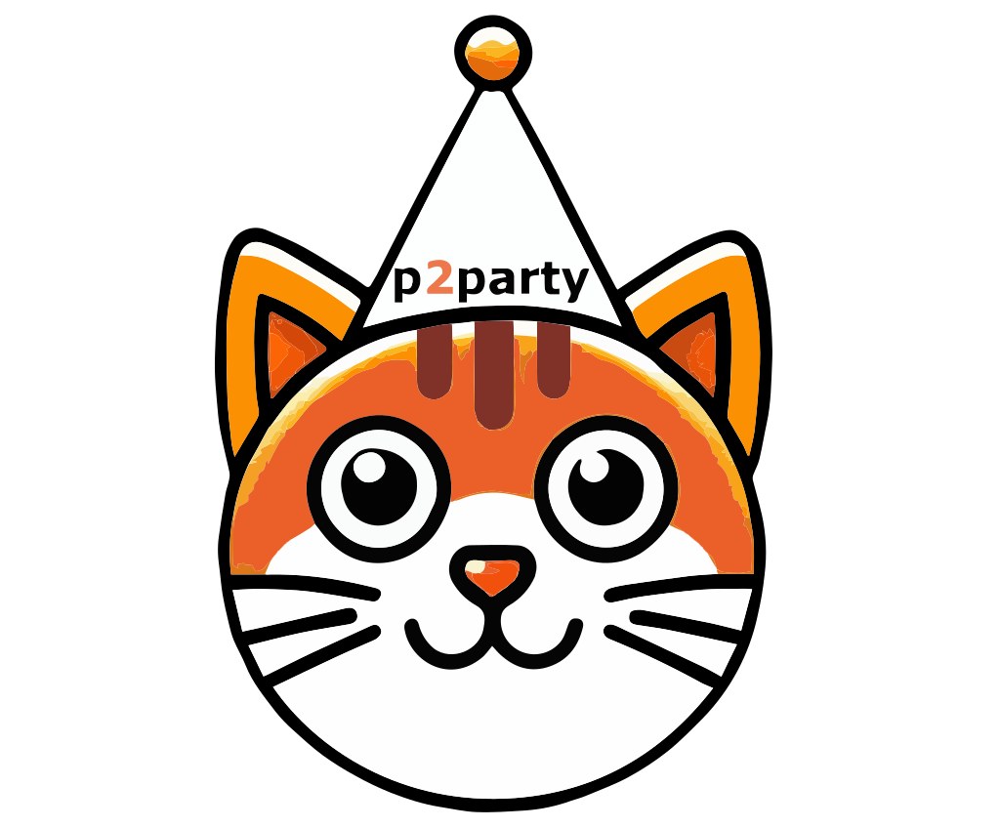

<p align="center">
  <a href="https://p2party.com">
    
  </a>
</p>

# p2party

Protocol-v4 end-to-end encryption and reliable file transfer over a WebRTC
room mesh.

Apache-2.0 · [LICENSE.md](LICENSE.md)

> Status: protocol v4 is an intentional wire break — v3 peers and persisted v3
> crypto rows are not resumed. The current code has not completed an
> independent third-party security audit.

## What is shipped

- Every peer in a room connects to every other present peer through WebRTC;
  the signaling service is not the message hub.
- Every peer edge performs authenticated interactive 3DH plus an
  authenticated, room-fixed [ML-KEM](https://csrc.nist.gov/pubs/fips/203/final)-512,
  ML-KEM-768 (default), or ML-KEM-1024 bootstrap. PIN rooms additionally
  authenticate with [CPace](https://datatracker.ietf.org/doc/html/draft-irtf-cfrg-cpace-21).
- Three chained key-confirmation messages complete the application-layer
  cryptographic handshake. An `RTCDataChannel` becoming `open` establishes the
  transport; it is not a substitute for that confirmation.
- Per-peer [Double Ratchet](https://signal.org/docs/specifications/doubleratchet/)
  state protects messages after the handshake.
- Message data travels in fixed 65,490-byte protocol-v4 frames. Cryptographic
  overhead is absorbed inside that fixed cell budget; randomized padding and
  decoy slots can hide a message's exact payload length within its transfer.
- Each outbound message has its own transfer identity and data channel, a
  cancellable handle, authenticated receipts, selective retransmission, and
  reconnect resume.
- Text and files up to the enforced 10 GiB application limit are supported.
  Browser builds use IndexedDB and, where available, OPFS for disk-backed large
  file receipt.
- Room capabilities have a compact 43-character base64url form, a versioned
  fragment invite, and an optional checksum-protected 24-word
  [BIP-39](https://github.com/bitcoin/bips/blob/master/bip-0039/bip-0039-wordlists.md)
  representation.
- `p2party/session` exposes the cryptography without
  [Redux](https://redux-toolkit.js.org/), IndexedDB, WebRTC, signaling,
  `window`, or `localStorage`.

Immediate delivery over the existing signaling rendezvous is the shipped
default. Scheduled timing cover is also wired as of 0.14.0: a room policy may
pin a cadence, lane count, and frames per cell, and every edge in the room then
emits fixed-size cells on that schedule whether or not there is data to send.
Sparse post-quantum healing (the OFFER/ADVANCE/ACK epoch exchange) is likewise
live on the mesh path, with persistence before dispatch and application traffic
blocked while an epoch is in flight.

The public `connect()` path still rejects opaque and blind meeting points —
any `rendezvousMode` other than `legacy-signaling` — because that transport is
not wired. The private BitTorrent extension remains a research direction, not a
shipped property.

The current signaling operator can observe room membership, peer identities,
network metadata, and timing. Fixed message cells and in-transfer decoys do not
by themselves provide continuous traffic-analysis resistance.

## Install

```sh
npm install p2party
```

That is the whole setup. The package ships its own WebAssembly cryptography and
its own database worker; there is no build step, no postinstall, and no native
dependency to compile.

Releases are published with npm provenance, so you can check that the tarball
was built by the tagged GitHub Actions run rather than uploaded by hand:

```sh
npm audit signatures
```

To build the artifact yourself instead, see
[Building from source](CONTRIBUTING.md#building-from-source). That path needs an
exact toolchain (Node 24, Emscripten 6.0.3, pinned submodules), because the
release build reproduces the pinned WASM and refuses to emit an artifact it
cannot attest.

## Send a message between two browsers

A complete working page is in
[`examples/browser-mesh/`](examples/browser-mesh/) — serve it, open it twice,
paste the invite from the first tab into the second tab's URL fragment:

```sh
bunx vite examples/browser-mesh
```

The part that matters is short:

```ts
import p2party from "p2party";

// One 256-bit capability. Share the invite; anyone holding it can join.
const invite = p2party.generateRoomInvite();
const room = await p2party.joinRoom(invite);

// Fires once per fully-arrived message, already decoded.
p2party.onMessage(room.id, ({ message }) => {
  console.log("received", message);
});

// A room id does not mean anyone can receive yet.
await p2party.waitForPeers(room.id);
await p2party.sendMessage("hello", "chat", room.id).done;
```

`joinRoom` resolves once the signaling service has assigned the room its id. It
rejects on a timeout rather than waiting forever, and takes an `AbortSignal` if
the user navigates away:

```ts
const controller = new AbortController();
// controller.abort() on unmount, route change, or a Cancel button.

const room = await p2party.joinRoom(invite, undefined, undefined, {
  timeoutMs: 10_000,
  signal: controller.signal,
});
```

Reading an inbound message needs its Merkle root, which arrives on the room's
`messages` state:

```ts
const rooms = p2party.roomSelector(p2party.store.getState());
const latest = rooms.find((r) => r.id === room.id)?.messages.at(-1);
if (latest) {
  const opened = await p2party.readMessage(latest.merkleRootHex);
  console.log(opened.message);
}
```

## Choose your integration

**`p2party`** — the browser room mesh. It owns signaling, full-mesh WebRTC,
Redux state, IndexedDB/OPFS, the handshake, the ratchet, and transfer with
resume. You own the room capability and policy, the UI, and the optional PIN.

**`p2party/session`** — the cryptography alone, for Node, Bun, native shells or
a custom network. It owns the handshake, the ratchet, uniform encrypted
envelopes and snapshots. **You own the transport**, including message-delimited
framing, peer-key trust and storage — see
[docs/session-api.md](docs/session-api.md).

**`p2party/session` + `p2party/libcrypto.wasm`** — the same, with the exact
release-built cryptographic module loaded from bytes you supply, for offline or
integrity-pinned deployments.

Deeper guides:

- [Getting started](docs/getting-started.md) — the browser tutorial
- [Wire format](docs/wire-format.md) — frame layouts and the handshake ladder
- [Store-free session API](docs/session-api.md) — the `p2party/session` contract
- [Protocol-v4 security boundary](docs/protocol-v4-security.md) — what is and
  is not a guarantee
- [References](docs/references.md) — standards, papers and related projects
- [Roadmap](ROADMAP.md) — what is next, and the open problems it depends on

## Browser mesh

Every peer present in the same room connects to every other peer. The signaling
service coordinates discovery and WebRTC setup; it is not the message hub. A
room with `n` participants therefore has up to `n(n - 1) / 2` peer edges.

`joinRoom()` covers the common case. The two steps underneath it are separate
when you need them — `connect()` starts the join and returns immediately,
`waitForRoom()` resolves once the id arrives:

```ts
await p2party.connect(invite);
// ...render a joining state, wire up other listeners...
const room = await p2party.waitForRoom(invite, { timeoutMs: 10_000 });
```

`joinRoom()` resolving does not mean every peer edge has finished its
handshake. The library gates message cryptography on that separately, so render
peer and message state from the exported store rather than treating the room as
ready for everything at once.

An open RTCDataChannel means its DTLS/SCTP transport is ready. It is not the
protocol-v4 acknowledgement: p2party next runs its authenticated HELLO plus
three chained confirmation flights over the main channel. Message receipts are
a third, delivery-level acknowledgement.

## Wire format

Fixed 65,490-byte cells, a 65-byte receipt frame, and outer frame tags that make
an application cell, a decoy and a post-quantum healing record indistinguishable
by size. Byte layouts, the handshake ladder and the healing exchange are in
[docs/wire-format.md](docs/wire-format.md).

## What a room invite looks like

One 256-bit capability, three presentations of the same bytes. Whoever holds it
can join the room, so it is the secret — treat it like one:

```text
compact   Mg10fDvjVDzXkuboBnfjuNWc26i35rYsjJHKpS7D58s          43 chars
fragment  v1.Mg10fDvjVDzXkuboBnfjuNWc26i35rYsjJHKpS7D58s      46 chars
words     craft hill business jelly crystal bunker furnace fresh trend
          crisp wedding immune flush horse people wolf renew good caught
          next fancy giggle palace huge                        24 words
```

In a URL the fragment goes after `#`, which keeps it out of the request line,
out of `Referer`, and out of ordinary server logs:

```text
https://p2party.com/#v1.Mg10fDvjVDzXkuboBnfjuNWc26i35rYsjJHKpS7D58s
```

All three decode to identical bytes, so peers can mix forms — one pastes a
link, another reads the words aloud over a phone call:

```ts
const capability = p2party.generateRoomCapability();

const compact = p2party.encodeRoomCapabilityBase64Url(capability); // 43 chars
const fragment = p2party.encodeRoomInviteFragment(capability); // v1.<compact>
const words = await p2party.encodeRoomCapabilityWords(capability); // 24 words

const fromWords = await p2party.decodeRoomCapabilityWords(words);
console.assert(p2party.encodeRoomCapabilityBase64Url(fromWords) === compact);

await p2party.connect(fragment);
```

`generateRoomInvite()` is the one-liner for the fragment form. The word list is
[BIP-39 English](https://github.com/bitcoin/bips/blob/master/bip-0039/bip-0039-wordlists.md)
and is checksum-protected — it encodes the same 256 bits, it is not a
lower-entropy password. The shipped `legacy-signaling` route still sends the
normalized capability to the signaling service, so a fragment is not
server-blind rendezvous.

## PIN rooms

A capability alone authenticates whoever _received the link_. If the link leaks
— a forwarded chat, a screenshot, a shared clipboard — the holder joins. A PIN
adds a second factor over a separate channel: peers must also prove they know
the same short secret, using [CPace](https://datatracker.ietf.org/doc/html/draft-irtf-cfrg-cpace-21),
a balanced PAKE, so the PIN itself never crosses the wire and a wrong PIN fails
the handshake instead of leaking a guess oracle.

PIN mode is **in addition to** identity authentication, never instead of it:

```ts
import p2party, { type RoomPolicyV1 } from "p2party";

const policy = {
  ...p2party.DEFAULT_ROOM_POLICY_V1,
  authMode: "pin",
  pqMode: "hybrid-mlkem1024", // 512 | 768 (default) | 1024, fixed up front
} satisfies RoomPolicyV1;

// Both peers need these exact bytes, carried out of band — spoken aloud,
// not sent through the same channel as the invite.
const pin = new TextEncoder().encode("correct horse battery staple");

try {
  await p2party.connect(invite, undefined, undefined, { policy, pin });
} finally {
  pin.fill(0); // connect() copied it into the in-memory room vault.
}
```

Room policy is immutable once the room is created locally, and every peer must
present the same policy and the same PIN bytes. The ML-KEM suite is fixed
before the handshake runs — there is no in-band negotiation, no downgrade, and
no classical fallback, so a mismatched peer fails closed rather than quietly
agreeing on something weaker.

PIN bytes are deliberately absent from the public policy, from Redux, from
persisted room records and from logs. Wipe your copy when the room is up.

## Scheduled cover traffic

Encryption hides what you say. It does not hide _that_ you said something —
an observer still sees a burst of frames the moment you press send. Scheduled
cover replaces that pattern with a constant one: every edge in the room emits
fixed-size cells on a fixed cadence whether or not there is anything to send,
and real chunks are substituted into slots that were going to be sent anyway.

```ts
const policy = {
  ...p2party.DEFAULT_ROOM_POLICY_V1,
  coverMode: "scheduled",
  coverCadenceMs: 10_000, // one cycle every 10s
  coverLanes: 2, // parallel schedules per edge
  coverFramesPerCell: 1, // 65,490-byte frames per slot
  coverDurationEpochs: 360,
} satisfies RoomPolicyV1;

p2party.validateRoomPolicyV1(policy); // throws before you build a room on it
```

The bounds are exported — `MIN_COVER_CADENCE_MS`, `MAX_COVER_CADENCE_MS`,
`MAX_COVER_LANES`, `MAX_COVER_FRAMES_PER_CELL`, `MIN_COVER_SLOT_MS` — so a
policy UI validates against the library instead of re-declaring limits that
drift.

Cover is a **room-wide** property: it hides timing only for as long as every
edge keeps emitting on schedule, and it costs bandwidth continuously. It has
been measured on loopback, not across a real network path, and fixed cells over
a fixed cadence are not by themselves traffic-analysis resistance — see
[The Last Hop Attack](https://doi.org/10.56553/popets-2025-0067) for how loop
cover over fixed cascades fails, and the
[security boundary](docs/protocol-v4-security.md) for what is actually claimed.
Immediate delivery remains the default.

## Send, cancel, and read

`sendMessage()` returns a `MessageTransferHandle`, not a promise: `transferId`
identifies this logical send, `cancel()` works even during hashing and channel
setup, and `done` settles after every started peer send and cleanup.

`done` **rejects** when no peer took delivery — an empty room, or a cancel.
Both are ordinary outcomes. The rejection is a `MessageDeliveryError` whose
`result.outcomes` carries the same per-peer detail a resolved value would, so
handle it rather than treating it as a crash. The quickstart above shows the
shape; [docs/getting-started.md](docs/getting-started.md#send-cancel-and-read)
covers reading inbound messages and the metadata-only read that avoids
materializing large files.

## Cryptography without WebRTC

`p2party/session` is the same protocol-v4 cryptography with no Redux, no
IndexedDB, no WebRTC, no signaling, no `window` and no `localStorage` — for
Node, Bun, a native shell, a CLI, or any transport you already have.

Nothing to configure. The WASM loads from the installed package, so this runs
offline:

```ts
import { generateSessionIdentity } from "p2party/session";

const identity = await generateSessionIdentity();
```

### Two peers, both sides

The session needs one thing from you: a transport. `send` hands off a message,
`recv` resolves with the next one. Whole messages, in order, no partial reads —
a WebSocket, a TCP socket with length prefixes, or a queue all qualify. An
in-memory pipe is enough to run both peers in one process:

```ts
// One one-way pipe. Two of these make a full-duplex transport.
const makeLink = () => {
  const queued: Uint8Array[] = [];
  const waiters: Array<(bytes: Uint8Array) => void> = [];
  return {
    send(bytes: Uint8Array) {
      const owned = Uint8Array.from(bytes); // copy: the caller reuses buffers
      const waiter = waiters.shift();
      if (waiter) waiter(owned);
      else queued.push(owned);
    },
    recv(): Promise<Uint8Array> {
      const bytes = queued.shift();
      return bytes
        ? Promise.resolve(bytes)
        : new Promise((resolve) => waiters.push(resolve));
    },
  };
};
```

Alice and Bob each generate a long-term identity, exchange Ed25519 public keys
out of band, agree on a channel binding, and hand the session two byte pipes.
Nothing below is elided — this is the whole setup:

```ts
import { createSession, generateSessionIdentity } from "p2party/session";

// 1. Long-term identities. Persist these; they are who each peer *is*.
const aliceIdentity = await generateSessionIdentity();
const bobIdentity = await generateSessionIdentity();

// 2. Trust. Each side must already know the other's Ed25519 public key —
//    pinned from a previous session, read off a QR code, or explicitly
//    TOFU-accepted. The session never decides this for you.
const alicePublicKey = aliceIdentity.ed25519PublicKey;
const bobPublicKey = bobIdentity.ed25519PublicKey;

// 3. Channel binding, identical on both sides but with the fingerprints
//    swapped. Bound into the handshake transcript so a relay cannot sit in
//    the middle and swap sides.
const channelId = crypto.getRandomValues(new Uint8Array(16));
const aliceFingerprint = crypto.getRandomValues(new Uint8Array(32));
const bobFingerprint = crypto.getRandomValues(new Uint8Array(32));

// 4. Two one-way pipes. Replace these with your socket, WebSocket, pipe or
//    queue — anything that delivers whole messages, in order.
const aliceToBob = makeLink();
const bobToAlice = makeLink();

// 5. Handshake. Both sides run concurrently: the flights are interactive, so
//    awaiting one before starting the other deadlocks.
const [alice, bob] = await Promise.all([
  createSession({
    role: "initiator",
    identity: aliceIdentity,
    peerIdentityEd25519PublicKey: bobPublicKey,
    channel: {
      channelId,
      localFingerprint: aliceFingerprint,
      remoteFingerprint: bobFingerprint,
    },
    transport: { send: aliceToBob.send, recv: bobToAlice.recv },
    mode: "nopin",
  }),
  createSession({
    role: "responder",
    identity: bobIdentity,
    peerIdentityEd25519PublicKey: alicePublicKey,
    channel: {
      channelId,
      localFingerprint: bobFingerprint,
      remoteFingerprint: aliceFingerprint,
    },
    transport: { send: bobToAlice.send, recv: aliceToBob.recv },
    mode: "nopin",
  }),
]);
```

For a PIN-authenticated session, both sides pass `mode: "pin"` with identical
`pin` bytes instead — the same CPace step the browser mesh uses.

### What goes over the wire

```ts
const encoder = new TextEncoder();
const decoder = new TextDecoder();

const sealed = await alice.encrypt(encoder.encode("hello bob"));

// sealed.protocolVersion === 4
// sealed.root   -> 32-byte Merkle root, authenticated as AEAD additional data
// sealed.frames -> [Uint8Array(65490)]  one uniform cell; a 9-byte message and
//                  a 60 KiB message produce byte-identical frame sizes.
//                  Each frame is:
//                    type(1) | DH pubkey(32) | N(8) | PN(8) | PQ epoch(8) |
//                    nonce(12) | ciphertext(65405) | Poly1305 tag(16)
//                  Only the 69-byte header is readable; it is authenticated,
//                  not secret. Everything else is indistinguishable from
//                  random to anyone without the message key.

// Hand sealed.frames to your transport verbatim. It must delimit records
// itself — the session returns opaque bytes, not a framed stream.
const opened = await bob.decrypt(sealed);
console.log(decoder.decode(opened)); // "hello bob"

// Either side may speak first, and simultaneous first sends are fine: the
// handshake primes both ratchet directions.
const reply = await bob.encrypt(encoder.encode("hi alice"));
console.log(decoder.decode(await alice.decrypt(reply))); // "hi alice"
```

Each logical message consumes one ratchet step. Replays and tampered frames are
rejected; out-of-order arrival is tolerated within a bounded skipped-key window.

### Suspend and resume

```ts
import { restoreSession } from "p2party/session";

const snapshot = await alice.serialize(); // plaintext secret — encrypt at rest
await alice.destroy();

const restored = await restoreSession(snapshot);

// Same ratchet, same counters. Bob notices nothing.
const later = await bob.encrypt(encoder.encode("still there?"));
console.log(decoder.decode(await restored.decrypt(later))); // "still there?"

snapshot.fill(0);
```

Run the complete two-party script — including the sparse post-quantum healing
exchange — from a checkout:

```sh
bun run examples/standalone-e2ee.ts
```

[`examples/standalone-e2ee.ts`](examples/standalone-e2ee.ts) is also shipped
inside the package, and includes the `makeLink()` helper used above.

Four things stay yours, because no library can decide them for you:

| You own               | Because                                                                                              |
| --------------------- | ---------------------------------------------------------------------------------------------------- |
| Peer-key trust        | `peerIdentityEd25519PublicKey` must be pinned or explicitly TOFU-accepted; the session never guesses |
| Message framing       | `encrypt()` returns opaque frames — your transport must delimit and length-check records itself      |
| Snapshot storage      | `serialize()` is plaintext secret material: encrypt at rest, and protect against rollback            |
| The `channel` binding | A channel id and two endpoint fingerprints, bound into the transcript so a relay cannot swap sides   |

Outside WebRTC there are no DTLS fingerprints to bind, so derive the channel
binding from whatever your transport authenticates — a TLS exporter, a session
id, or random bytes both sides agree on out of band. The full contract, the
envelope codec and the sparse-PQ healing hooks are in
[docs/session-api.md](docs/session-api.md).

## Running the operations one at a time

`joinRoom()` and `createSession()` are the batteries-included paths. Every step
they take is also a public call, so you can drive the protocol yourself.

**Identity, signing, and recovery phrases.** Keys are Ed25519; the recovery
phrase is BIP-39, so a wallet-style backup flow works without a second library:

```ts
const mnemonic = await p2party.generateMnemonic(256); // 24 words
const keyPair = await p2party.keyPairFromMnemonic(mnemonic); // deterministic
const fresh = await p2party.newKeyPair(); // or just random

const bytes = new TextEncoder().encode("anything you want attributable");
const signature = await p2party.sign(bytes, keyPair.secretKey);
const ok = await p2party.verify(bytes, signature, keyPair.publicKey);
```

**Room policy as data.** A policy is a value you can encode, hash, compare and
validate before anything touches the network — useful for showing two peers
that they really are about to join the same room:

```ts
const policy = { ...p2party.DEFAULT_ROOM_POLICY_V1 } satisfies RoomPolicyV1;

const encoded = p2party.encodeRoomPolicyV1(policy); // canonical bytes
const digest = await p2party.hashRoomPolicyV1(policy); // stable identifier
p2party.validateRoomPolicyV1(policy); // throws with the offending field

// Peers fail closed on a policy mismatch, so compare before you connect and
// you can say *which* setting differs instead of surfacing a failed handshake.
// `encoded` here stands in for the canonical bytes the other peer sent you.
const theirs = p2party.decodeRoomPolicyV1(encoded);
const agreed = p2party.roomPoliciesEqualV1(policy, theirs);
```

**The ratchet, step by step.** A `P2PartySession` exposes each operation
individually rather than only a send/receive loop:

| Call                                         | What it does                                               |
| -------------------------------------------- | ---------------------------------------------------------- |
| `encrypt` / `decrypt`                        | One ratchet step per logical message                       |
| `serialize` / `restoreSession`               | Snapshot and resume the exact ratchet state                |
| `prepareHealing`                             | Start a post-quantum epoch when one is due                 |
| `acceptControlFrame`                         | Process an inbound OFFER / ADVANCE / ACK, return the reply |
| `pendingControl`                             | Re-emit the exact frame for a dropped flight               |
| `pqEpoch`, `healingInProgress`, `canEncrypt` | Inspect live state                                         |
| `destroy`                                    | Wipe key material                                          |

**Driving the ratchet by hand.** Nothing turns the ratchet on a timer. Each
`encrypt()` advances it one step, and post-quantum healing runs only when you
ask. A complete exchange, both sides, from a live session:

```ts
// The ratchet advances per message, and you can watch it do so.
console.log(alice.pqEpoch); // 0n before any healing exchange

// Healing is due after 64 messages or 24 hours, and only on your turn.
// prepareHealing() returns { frame: null } when it is neither.
const offer = await alice.prepareHealing();

if (offer.frame) {
  // THE RULE: persist before the frame leaves. A crash after sending but
  // before persisting loses the ephemeral KEM secret, and the two sides then
  // disagree about the epoch. That is a dead session, not a slow one.
  await alice.serialize();
  const advance = await bob.acceptControlFrame(offer.frame); // OFFER  -> ADVANCE

  await bob.serialize();
  const ack = await alice.acceptControlFrame(advance.frame!); // ADVANCE -> ACK

  await alice.serialize();
  await bob.acceptControlFrame(ack.frame!); // ACK -> done

  console.log(alice.pqEpoch, bob.pqEpoch); // 1n 1n
}

// If a flight is dropped, re-send the exact same bytes. Do not call
// prepareHealing() again — fresh randomness forks the exchange.
const retry = await alice.pendingControl();
if (retry) transport.send(retry);
```

`healingInProgress` is true while an exchange is open, and application traffic
is blocked until it closes. That is deliberate: a message encrypted under an
ambiguous epoch is worse than a message delayed by one round trip.

Every `serialize()` above sits **before** its send, and that ordering is the
whole contract. `requiresPersistBeforeSend` on the returned
`SessionControlOutput` tells you when a durable write is genuinely required, so
you can skip the disk hit on an exact duplicate response.

[`examples/standalone-e2ee.ts`](examples/standalone-e2ee.ts) runs this end to
end, including the 64 messages that make an exchange due.

The lower-level primitives — X25519, HKDF-SHA512, ML-KEM, CPace, the Merkle
tree, the raw ratchet — are deliberately _not_ exported. They are easy to
combine into something that looks right and is not, and the whole point of the
package is that the combination has been done once, carefully. If you need
those, use [libsodium](https://github.com/jedisct1/libsodium) and
[mlkem-native](https://github.com/pq-code-package/mlkem-native) directly, which
is what this package compiles.

## No build step: a script tag and the CDN

Every release publishes its browser bundle, its database worker and its
cryptographic module as immutable, versioned CDN objects. The version is in the
path, so a URL names exactly one build and is safe to cache forever. Drop the
script in and `window.p2party` is there — no npm, no bundler, no build:

```html
<!doctype html>
<meta charset="utf-8" />
<title>p2party in one file</title>

<script
  src="https://cdn.p2party.com/@0.14.0/p2party.min.js"
  integrity="sha384-opIVtS4CL1uMUDzj37ypEPeSSzCqM1tFW3WAXd7X7Po/PsE/FL9DmlzYMrEJFjr8"
  crossorigin="anonymous"
></script>

<script type="module">
  // The bundle embeds its worker and fetches its own WASM from the same
  // versioned path, under a build-pinned SHA-384 SRI.
  const invite = p2party.generateRoomInvite();
  location.hash = invite; // share this URL; anyone holding it can join

  const room = await p2party.joinRoom(location.hash.slice(1) || invite);

  p2party.onMessage(room.id, ({ message }) => {
    document.body.append(
      Object.assign(document.createElement("p"), {
        textContent: message,
      }),
    );
  });

  await p2party.waitForPeers(room.id);
  await p2party.sendMessage("hello from a script tag", "chat", room.id).done;
</script>
```

Open that file in two tabs, paste the first tab's URL into the second, and they
connect directly to each other.

The three published objects:

```text
https://cdn.p2party.com/@0.14.0/p2party.min.js     UMD bundle -> window.p2party
https://cdn.p2party.com/@0.14.0/db.worker.js       IndexedDB/OPFS worker
https://cdn.p2party.com/@0.14.0/libcrypto.wasm     the cryptographic module
```

The `integrity` value above is this release's bundle, and the release build
fails if the README and the built artifact ever disagree — so it is safe to
copy verbatim. The worker, if you host it yourself, is
`sha384-xpC0axO9Z2Q/XvKvps45jwZ7ldG9jgXx1b5rcSv24+rCiM5qhox6jqlBaIStbzoa`.

The WASM is integrity-checked whether or not you pin the script: that hash is
compiled into the bundle and cannot be turned off.

## Local, self-hosted, or release-pinned WASM

The browser root always fetches the exact versioned CDN WASM with a build-pinned
SHA-384 SRI value by default. A self-hosted browser app can point it at the
same release bytes before calling `connect()`:

```ts
import p2party from "p2party";

p2party.setWasmSourceUrl(
  new URL("/vendor/p2party-0.14.0/libcrypto.wasm", window.location.href),
);
```

The SRI check remains active, so a URL serving different bytes fails closed.

### Download the WASM from the CDN

Every release publishes its cryptographic module as an immutable, versioned
object. The path carries the version, so a URL always names exactly one build
and is safe to cache forever:

```sh
curl -O https://cdn.p2party.com/@0.14.0/libcrypto.wasm
curl -O https://cdn.p2party.com/@0.14.0/libcrypto.provenance.json
```

Check what you downloaded before you serve it. The SHA-256 and the SRI value
are both recorded in the provenance file that sits next to it:

```sh
shasum -a 256 libcrypto.wasm
openssl dgst -sha384 -binary libcrypto.wasm | openssl base64 -A
```

For 0.14.0 those are
`7eea31157e69ac61f3a512b624d5c210296302fd289fc2b65c63ecc31a056267` and
`sha384-pBMyUqQ3KBztxgeJMgDFZeohfj9QlAFNwt4/gRlqT0vlZ2kbkKxv+q5DwbZOBuUP`.
They are the same bytes npm ships — the release workflow uploads the CDN object
from the very tarball it publishes, then re-downloads and compares before
`npm publish` runs, so the two can never diverge.

Serve the file yourself and point the browser root at it with
`setWasmSourceUrl()` above, or hand the bytes straight to `p2party/session`.

On Node and Bun, `p2party/session` needs none of this: it reads the WASM from
the installed package and checks it against the same pinned SHA-384, so an
offline or air-gapped install works with no configuration and no network call.
Supply `wasmBinary` only to override that — bytes you host, embed, or verify
yourself:

```ts
import { readFile } from "node:fs/promises";
import { generateSessionIdentity } from "p2party/session";

const wasmBinary = await readFile("/opt/p2party/libcrypto.wasm");
const identity = await generateSessionIdentity({ wasmBinary });
```

The package also exports `p2party/libcrypto.provenance.json`, recording the
libsodium and mlkem-native commits, the Emscripten release, and the artifact's
digests. JavaScript and WASM are one release unit; never pair this release's
JavaScript with an older module.

The release gate runs packaged identity generation through both Node ESM and
CommonJS, once with explicit bytes and once with no arguments at all — the
second pass with `fetch` stubbed to throw, so a silent CDN fallback fails the
release rather than surfacing later as a broken offline install.

## Development

The reproducible release toolchain is Node 24.11.1, npm 11.6.2, Bun 1.3.14,
Emscripten 6.0.3, and the repository's pinned libsodium source object. npm and
`package-lock.json` are the dependency authority; Bun is the test runner.

```sh
git clone --recurse-submodules https://github.com/p2party/p2party-js.git
cd p2party-js
git -C libsodium fetch --depth=1 origin 2ce4d906a68eae82b27b4867f3d4172ec508cb27
npm ci
npm run predist
npm run check
```

`npm run release:pack` is the only supported package build. It rebuilds and
validates the cryptographic artifacts in a fresh staging tree, checks the
vendored source digests and provenance, enforces the tarball allowlist, and
produces `p2party-<version>.tgz`. Direct source-tree publication is refused.

Tagged releases publish immutable CDN objects first, fetch the public WASM back
and compare its exact bytes, SHA-256, and SRI to the validated build, and only
then publish the npm tarball with provenance.

## Built on

Cryptography, compiled into the shipped `libcrypto.wasm`:

| Component                                                                                     | Provides                                                         |
| --------------------------------------------------------------------------------------------- | ---------------------------------------------------------------- |
| [libsodium](https://github.com/jedisct1/libsodium)                                            | X25519, Ed25519, ChaCha20-Poly1305, BLAKE2b, HKDF-SHA512, Argon2 |
| [mlkem-native](https://github.com/pq-code-package/mlkem-native)                               | ML-KEM-512/768/1024                                              |
| [Emscripten](https://emscripten.org/)                                                         | Compiles both to the pinned WebAssembly module                   |
| [Redux Toolkit](https://redux-toolkit.js.org/)                                                | The browser root's state store                                   |
| [BIP-39 wordlist](https://github.com/bitcoin/bips/blob/master/bip-0039/bip-0039-wordlists.md) | The 24-word capability and recovery-phrase encoding              |

Standards the wire format implements:

| Standard                                                                                                          | Where it appears                                |
| ----------------------------------------------------------------------------------------------------------------- | ----------------------------------------------- |
| [FIPS 203](https://csrc.nist.gov/pubs/fips/203/final)                                                             | ML-KEM bootstrap and healing epochs             |
| [RFC 8439](https://www.rfc-editor.org/rfc/rfc8439.html)                                                           | ChaCha20-Poly1305 for every chunk frame         |
| [RFC 5869](https://www.rfc-editor.org/rfc/rfc5869.html)                                                           | HKDF root and chain-key derivation              |
| [RFC 7748](https://www.rfc-editor.org/rfc/rfc7748.html)                                                           | X25519 for 3DH and the ratchet DH turns         |
| [RFC 8032](https://www.rfc-editor.org/rfc/rfc8032.html)                                                           | Ed25519 identities and cross-signatures         |
| [draft-irtf-cfrg-cpace-21](https://datatracker.ietf.org/doc/html/draft-irtf-cfrg-cpace-21)                        | The PIN-room balanced PAKE                      |
| [RFC 8831](https://datatracker.ietf.org/doc/html/rfc8831) / [8832](https://datatracker.ietf.org/doc/html/rfc8832) | WebRTC data channels                            |
| [RFC 8122](https://datatracker.ietf.org/doc/html/rfc8122)                                                         | SDP DTLS fingerprints bound into the transcript |
| [RFC 9794](https://www.rfc-editor.org/rfc/rfc9794.html)                                                           | PQ/T hybrid terminology                         |

The design follows the [Double Ratchet](https://signal.org/docs/specifications/doubleratchet/)
and [X3DH](https://signal.org/docs/specifications/x3dh/) specifications, and
sparse post-quantum healing is directly inspired by Signal's
[SPQR](https://signal.org/blog/spqr/) — a different construction, not a
reimplementation, and not independently analysed. Full citations, the papers
behind the design, and comparable projects are in
[docs/references.md](docs/references.md); what is deliberately still open is in
the [roadmap](ROADMAP.md).

## Security and licensing

Report vulnerabilities privately according to [SECURITY.md](SECURITY.md).
Contributions are covered by [CONTRIBUTING.md](CONTRIBUTING.md) and the
[Code of Conduct](CODE_OF_CONDUCT.md).

p2party is licensed under [Apache-2.0](LICENSE.md). Vendored and bundled
components retain their own terms; see
[THIRD_PARTY_NOTICES.md](THIRD_PARTY_NOTICES.md).
